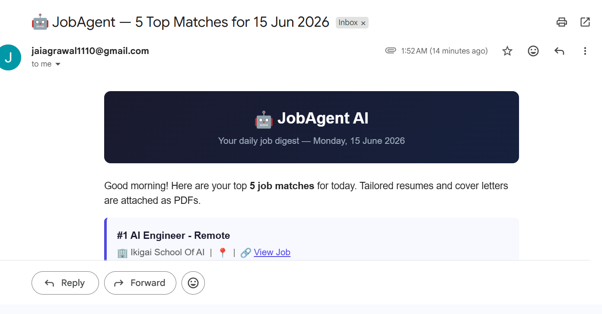
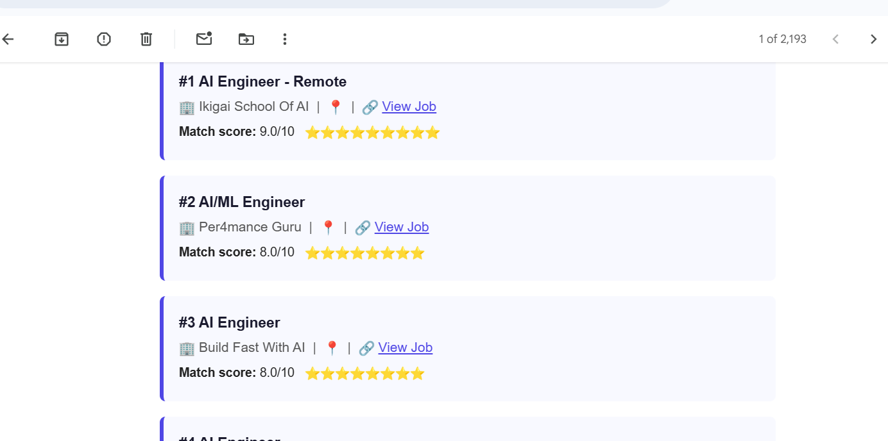
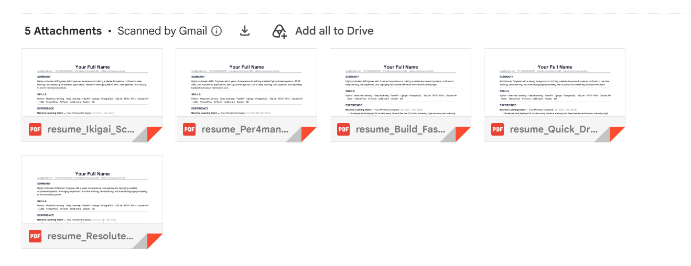

# 🤖 JobAgent AI

Autonomous job-hunting pipeline. Every morning at 7 AM it scrapes jobs, scores them with Claude, tailors your resume + cover letter, and emails you a digest with PDFs ready to attach.

## Project Structure

```
jobagent/
├── config.py            # ← YOUR SETTINGS: profile, keywords, email, threshold
├── database.py          # SQLite manager + SHA-256 deduplication
├── scorer.py            # Claude API job scorer (1–10 match)
├── tailor.py            # Claude resume tailor + cover letter generator
├── pdf_generator.py     # ReportLab PDF builder (resume + cover letter)
├── emailer.py           # Gmail SMTP digest sender
├── scheduler.py         # Runs full pipeline daily at 7 AM
├── run.py               # One-off full pipeline runner
├── requirements.txt
├── resume/
│   └── base_resume.json # ← FILL THIS IN with your real profile
├── data/
│   ├── jobagent.db      # SQLite database (auto-created)
│   └── pdfs/            # Generated PDF resumes
├── logs/
│   └── jobagent.log
└── scrapers/
    ├── __init__.py
    ├── indeed.py        # Indeed RSS feed parser
    ├── internshala.py   # Internshala BeautifulSoup scraper
    └── wellfound.py     # Wellfound scraper
```
---

## Screenshots

### Daily Email Digest


### Job Match Scores


### Tailored Resume PDFs


---

## Setup

```bash
# 1. Install dependencies
pip install -r requirements.txt

# 2. Add your Anthropic API key
export ANTHROPIC_API_KEY=sk-ant-...

# 3. Fill in your profile
nano config.py          # update PROFILE, EMAIL_*, SCORE_THRESHOLD

# 4. Fill in your resume
nano resume/base_resume.json

# 5. Run once to test
python run.py

# 6. Start the daily scheduler
python scheduler.py
```

## Gmail Setup (for email digest)

1. Enable 2FA on your Google account
2. Go to https://myaccount.google.com/apppasswords
3. Create an App Password → copy it into `config.py` as `EMAIL_APP_PASSWORD`

## Weekly Build Plan

| Week | Module | Status |
|------|--------|--------|
| 1 | Job Scraper (Indeed, Internshala, Wellfound) | ✅ |
| 2 | Claude Scorer + Resume Tailor | ✅ |
| 3 | PDF Generator + Email Digest | ✅ |
| 4 | Scheduler + Deploy | ✅ |

## Cost

| Component | Cost |
|-----------|------|
| Groq API | Free |
| Job sources | Free |
| Gmail SMTP | Free |
| Hosting (Railway / your PC) | Free |
| **Total** | **0** |
